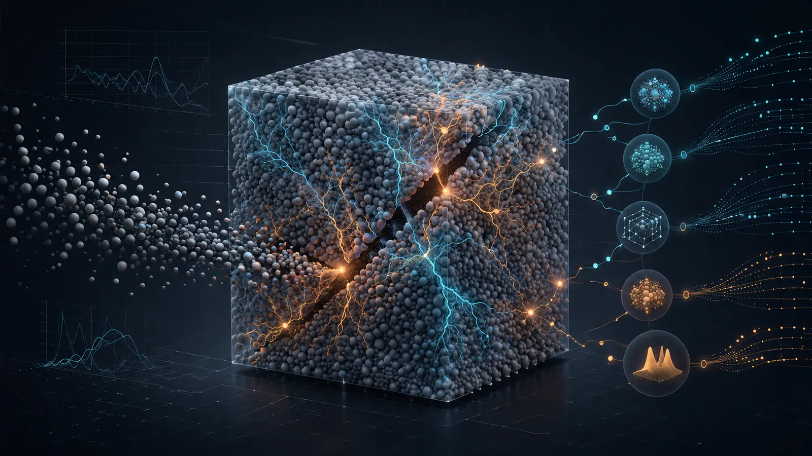

<div align="center">



# PFC Codex Skills · PFC 离散元建模技能包

**给 AI Agent（Claude Code / Codex / Cursor 等）用的 ITASCA PFC 全流程技能包——从规划、建模、标定、求解到后处理与可视化**

24 个技能 · PFC 6.0 优先模板 · 七阶段生命周期 · 手动 / 双目标 / 快速 / 自动四条标定路线 · ParaView/Python/vedo 后处理 · AE/能量分析 · 发布前确定性校验

[](LICENSE)
[](skills/pfc-skill-pack/SKILL.md)
[](references/skill-index.md)
[](scripts/validate_skills.py)
[](CONTRIBUTING.md)
[](https://github.com/jiangnan030-del/pfc-codex-skills/stargazers)
[](#-快速开始)

</div>

---

一个面向 AI Agent 的 PFC（Particle Flow Code）离散元仿真技能包。你用自然语言描述任务，它按固定的**七阶段生命周期**和**路由表**，把规划、试样生成、接触模型选择、微参数标定、求解控制、后处理、验证交付拆给对应专家技能——并把"可移植、可复现、可校验"的死规则交给脚本兜底，而不是靠模型自觉。

本仓库把 `.codex/skills` 技能家族打包成可移植的 Agent Skills。设计沿用 `gzh-design-skill` 的关注点分离模式：每个技能一个简短的 `SKILL.md` 入口，`references/` 放理论/命令笔记，`scripts/` 放可执行助手，`examples/` 放最小可复现示例，发布前跑确定性校验。

## ✨ 核心特性

- **24 个技能家族**：1 个治理枢纽（`pfc-skill-pack`）+ 1 个编排器（`pfc-workflow`）+ 22 个专家子技能，覆盖建模基础、接触模型、标准试验、标定、脆性岩石专题、动力学与耦合、后处理与可视化。
- **七阶段生命周期**：`P1` 规划 → `P2` 预处理/试样 → `P3` 标定 → `P4` 求解控制 → `P5` 后处理 → `P6` 验证 → `P7` 交付，跨阶段任务留在 `pfc-workflow`，只把专家部分委托给子技能。
- **PFC 6.0 优先**：所有公开模板默认 PFC 6.0 兼容；版本差异（5.0→6.0、7.0）在 `references/pfc5-to-pfc6-migration-map.md` 显式声明，不靠记忆。
- **四条标定路线**：手动伺服微宏映射（`pfc-servo-calibration`）· 双杠杆/双靶标小预算收敛（`dual-target-calibration`）· LPBM 13 因子正交 + 回归反解（`pfc-fast-calibration`）· LHS→代理→贝叶斯优化自动标定（`pfc-workflow`）。
- **可移植不绑死本机**：用相对路径 + 占位符 `<PFC_CONSOLE_EXE>` / `<CASE_DIR>`，绝不出现私有绝对路径；校验脚本确定性扫描。
- **后处理全覆盖**：标准曲线/场图/动画（`pfc-postprocessing`）· vedo 三维力链/裂纹/位移场（`pfc-vedo-postprocess`）· AE 事件/能量/矩张量/震源机制（`pfc-ae-energy`）。
- **确定性发布校验**：`validate_skills.py` 扫 frontmatter、断链、绝对路径、疑似密钥、超大文件、二进制资产——0 ERROR 才推送 GitHub。
- **Agent 友好**：每个技能入口是纯文本 `SKILL.md` + `agents/openai.yaml`，任何能读 Skill 目录的 Agent 都能用，输入输出全是文本/命令流/数据表。

## 👀 技能家族架构

治理枢纽 + 编排器 + 专家子技能的三层结构（`pfc-skill-pack` 定义约定，`pfc-workflow` 编排全生命周期，子技能按需路由）：

```text
pfc-skill-pack          # 治理层：路由约定、资产清单、PFC5→6 迁移、插件策略
  └─ pfc-workflow       # 编排层：P1–P7 全生命周期，按阶段把专家任务分派给子技能
      ├─ pfc-basics            pfc-contact-models     pfc-standard-tests
      ├─ pfc-servo-calibration dual-target-calibration pfc-fast-calibration
      ├─ pfc-fish               pfc-cad-import           pfc-modeling-techniques
      ├─ pfc-gbm-brittle-rock  pfc-mineral-heterogeneity  pfc-brittle-rock-bpm
      ├─ pfc-equivalent-crystal-model  pfc-flat-joint-brittle-rock
      ├─ pfc-dynamics          pfc-stress-wave-aelocation
      ├─ pfc-fluid-coupling    pfc-flac-coupling
      └─ pfc-postprocessing    pfc-vedo-postprocess   pfc-ae-energy   xxd-data-viz
```

> 📚 **完整技能清单（含文件/脚本/描述） → [references/skill-index.md](references/skill-index.md)**，由 `validate_skills.py --write-index` 自动生成。

## ✅ 适合 / ❌ 不适合

**✅ 适合**：PFC2D/PFC3D 从零建模 · 颗粒/胶结/节理材料接触模型选择 · UCS/巴西劈裂/双轴/三轴/直剪标准试验 · 微参数标定（弹性→强度→摩擦）· 力链/裂纹/孔隙率/应力应变导出 · GBM/等效晶格/平节理脆性岩石 · 动力/地震/爆破/应力波/AE 定位 · 流固耦合与 PFC-FLAC 耦合 · 自动标定（LHS/代理/贝叶斯）· 把 PFC 项目整理成可复现、可发布的工作流。

**❌ 不适合**：非 PFC/DEM 的连续介质仿真（用 FLAC/ANSYS 等）· 替你获取 PFC/FLAC3D/ParaView 软件授权（本包只给命令流模板，不含授权）· 代替真实试验数据（标定需用户提供宏观目标）· 脱离 PFC 版本盲跑（务必先确认 6.0/7.0）。

## 🗂 常见使用场景

| 你的任务 | 推荐入口技能 |
|---|---|
| 从零搭一个 PFC 项目（不知道从哪开始） | `pfc-workflow`（走 P1 规划，再分派） |
| 域/球/墙/clump/rblock/groups 基础建模 | `pfc-basics` |
| 选接触本构、CMAT、胶结方法 | `pfc-contact-models` |
| UCS/巴西/双轴/三轴/直剪标准试验 | `pfc-standard-tests` |
| 手动伺服 + 微宏参数映射 | `pfc-servo-calibration` |
| 两个活跃杠杆同时命中两个耦合靶标 | `dual-target-calibration` |
| LPBM 13 因子正交快速标定 | `pfc-fast-calibration` |
| LHS/代理/贝叶斯自动标定 | `pfc-workflow`（自动标定路线） |
| FISH 函数/回调/历史/IO | `pfc-fish` |
| CAD/DXF/STL 几何导入、颗粒填充 | `pfc-cad-import` |
| GBM/等效晶格/平节理脆性岩石 | `pfc-gbm-brittle-rock` 等脆性岩专题 |
| 数字图像矿物 segmentation、多矿物 LPBM | `pfc-mineral-heterogeneity` |
| 动力/地震/爆破加载 | `pfc-dynamics` |
| 应力波传播 / 无速度 AE 震源定位 | `pfc-stress-wave-aelocation` |
| 流固耦合 / CFD / 渗流 | `pfc-fluid-coupling` |
| PFC-FLAC/FLAC3D 离散-连续耦合 | `pfc-flac-coupling` |
| 标准曲线/场图/VTK 导出/动画 | `pfc-postprocessing` |
| vedo 三维力链/裂纹/位移场渲染 | `pfc-vedo-postprocess` |
| AE 事件/能量/矩张量/震源机制图 | `pfc-ae-energy` |
| 中国传统色数据可视化配色 | `xxd-data-viz` |

## 🎨 技能家族（24 个）

按职能分组，每组都打磨到"按路由调用即用"：

| 分组 | 技能 | 职责 |
|---|---|---|
| **治理 & 编排** | `pfc-skill-pack` · `pfc-workflow` | 包级约定、路由；P1–P7 全生命周期编排 |
| **建模基础** | `pfc-basics` · `pfc-contact-models` · `pfc-fish` · `pfc-cad-import` · `pfc-modeling-techniques` | 模型生命周期、接触本构、FISH、几何导入、建模技巧 |
| **标准试验** | `pfc-standard-tests` | UCS/巴西/双轴/三轴/直剪/三点弯曲 PFC 6.0 模板 |
| **标定** | `pfc-servo-calibration` · `dual-target-calibration` · `pfc-fast-calibration` | 手动伺服微宏映射；双杠杆/双靶标小预算标定；LPBM 13 因子正交快速标定 |
| **脆性岩石专题** | `pfc-brittle-rock-bpm` · `pfc-equivalent-crystal-model` · `pfc-flat-joint-brittle-rock` · `pfc-gbm-brittle-rock` · `pfc-mineral-heterogeneity` | BPM 极限、等效晶格、平节理、GBM、矿物非均质 |
| **动力学 & 耦合** | `pfc-dynamics` · `pfc-stress-wave-aelocation` · `pfc-fluid-coupling` · `pfc-flac-coupling` | 动力/地震、应力波/AE 定位、流固耦合、离散-连续耦合 |
| **后处理 & 可视化** | `pfc-postprocessing` · `pfc-vedo-postprocess` · `pfc-ae-energy` | 标准图/场/动画、vedo 三维、AE/能量/震源机制 |
| **数据可视化** | `xxd-data-viz` | 中国传统色数据可视化配色板 |

> 每个技能的文件数、脚本数、触发条件见 [`references/skill-index.md`](references/skill-index.md)。项目级工作请从 `pfc-workflow` 起步，它把专家子任务路由给子技能并保持案例生命周期可复现。

## 🚀 快速开始

### 方式一：手动 clone 到 Agent 技能目录

```bash
git clone https://github.com/jiangnan030-del/pfc-codex-skills.git ~/.codex/skills/pfc-codex-skills
```

### 方式二：让 AI 自己装

对**任意 Agent**（Claude Code / Codex / Cursor 等）说一句：

> 请帮我查找并自动安装 https://github.com/jiangnan030-del/pfc-codex-skills 这个 skill 包

它会自行 clone 到对应的 skills 目录并接入。

### 方式三：复制单个技能

只想要某一个技能，把 `skills/<skill>/` 整个文件夹拷进你的 Agent skills 目录即可（每个技能自包含）。

装好后，直接对 Agent 说：

```text
用 pfc-workflow 规划一个 PFC 6.0 UCS 标定工作流。
用 pfc-postprocessing 刷新应力-应变、力链、裂纹、位移图。
保存态导出完成后，用 pfc-ae-energy 跑 AE/能量后处理流水线。
```

## 📖 使用流程（七阶段生命周期）

除非用户明确收窄范围，`pfc-workflow` 按以下七阶段推进，跨阶段任务留在编排器内，只把专家部分委托给子技能：

1. **P1 规划** — 先定五项再碰代码：维度（2D/3D）· 试样/材料类（颗粒/胶结/节理/耦合）· 加载路径（UCS/巴西/双轴/三轴/直剪/循环/蠕变）· 目标观测量 · 输出契约。用 `templates/scope.md` 作骨架。
2. **P2 预处理/试样** — 固定随机种子、明确级配、显式边界、分阶段存档（压实/胶结/加载）。标准试验先走 `pfc-standard-tests` 选模板再回编排器。
3. **P3 标定** — 默认顺序：弹性（`emod` + 刚度比）→ 强度（胶结强度）→ 摩擦/破坏包络。需伺服/边界控制走 `pfc-servo-calibration`；恰好两个杠杆/两个靶标且预算严格时走 `dual-target-calibration`；需 LPBM 13 因子快速标定走 `pfc-fast-calibration`；维度更高或局部响应失效时转自动优化。
4. **P4 求解控制** — 先小批量试算再全长；显式控制时步、阻尼、停止准则、批策略；存重启态而非一根长脆跑。
5. **P5 后处理** — 至少可复现导出：应力-应变、峰值/残余、裂纹演化、力链、孔隙率、绑定存态。标准图走 `pfc-postprocessing`，vedo 三维走 `pfc-vedo-postprocess`，AE/能量走 `pfc-ae-energy`。
6. **P6 验证** — 分两类：验证（数值设置/分辨率/时步/阻尼敏感性）+ 确认（与试验/基准吻合）。
7. **P7 交付** — 三类产物：模型与导出数据 · 图与汇总表 · 含版本/种子/参数表/命令流溯源的方法或报告文本。

## 🧩 可移植性约束（已内置兜底）

公开文档必须可移植，由校验脚本确定性检查，而非靠模型自觉：

- 用相对路径或占位符 `<PFC_CONSOLE_EXE>` / `<CASE_DIR>`，**禁止**私有绝对路径（Windows 盘符路径或 Linux 挂载路径）。
- **禁止**提交生成的 `.sav`/`.p2sav`/`.p3sav`/`.p2prj`/`.p3prj`、视频、PDF、压缩包、私有试验数据集、二进制助手程序（`.exe`/`.dll`）。
- 可执行源码放 `scripts/`，可复用案例契约放 `templates/`，背景理论/命令笔记放 `references/`。
- 默认 PFC 6.0 兼容模板，除非某技能显式声明另一目标版本。

## 🔁 可验证循环

改技能或工作流后，用发布前校验防回归：

```bash
# <PYTHON312> 替换为你的 Python 3.8+ 解释器路径（本机为 E 盘 Python 3.12）
<PYTHON312>/python.exe scripts/validate_skills.py
# 重新生成技能索引
<PYTHON312>/python.exe scripts/validate_skills.py --write-index
```

`validate_skills.py` 确定性检查：

- 必需 frontmatter（`name` / `description`）
- 失效的本地 Markdown 链接
- 私有绝对路径（Windows 盘符路径 / Linux 挂载路径）
- 疑似泄露的密钥（`ghp_` / `github_pat_` / `sk-` 前缀）
- 超大文件（> 5 MB）
- 发布风险二进制资产（`.exe`/`.dll`/`.sav` 等）

逻辑：**0 ERROR 才推送 GitHub**。详见 [`CONTRIBUTING.md`](CONTRIBUTING.md)。

## 💡 为什么这么设计

- **约束优于自由** — 固定七阶段生命周期 + 路由表保住输出下限，不让模型每次现搭流程、风格飘忽。
- **质量靠脚本不靠自觉** — 可移植性、密钥、断链这类死规则交给 `validate_skills.py`，模型只做内容与命令判断。
- **换模型不走样** — 工作流逻辑全沉淀在 `references/` + `scripts/` + `templates/` 里，不依赖某家模型，Claude / GPT / Gemini / 国产模型都能跑出一致流程。
- **Agent 友好** — 每个技能入口是纯文本 `SKILL.md` + `agents/openai.yaml`，输入输出全是文本/命令流/数据表，天然适配 Claude Code / Codex / Cursor。
- **PFC 6.0 first** — 默认 6.0 兼容，版本差异显式声明在迁移映射里，不靠模型"记得住"。
- **可移植不绑死本机** — 相对路径 + 占位符，校验脚本扫绝对路径，克隆到任何机器都能用。

## 📁 目录结构

```text
pfc-codex-skills/
├── README.md                       # 本文档
├── CONTRIBUTING.md                 # 贡献指南与质量契约
├── LICENSE                         # MIT
├── .gitignore                      # 忽略生成态/视频/压缩包/二进制
├── scripts/
│   └── validate_skills.py          # 发布前确定性校验 + 索引生成
├── references/
│   └── skill-index.md              # 自动生成的技能清单
└── skills/
    ├── pfc-skill-pack/             # 治理枢纽
    ├── pfc-workflow/               # 编排器（P1–P7）
    ├── pfc-basics/                 # 建模基础
    ├── pfc-contact-models/         # 接触本构
    ├── pfc-standard-tests/         # 标准试验模板
    ├── pfc-servo-calibration/      # 手动伺服标定
    ├── dual-target-calibration/    # 双杠杆/双靶标小预算标定（AGPL-3.0）
    ├── pfc-fast-calibration/       # LPBM 快速标定
    ├── pfc-fish/                   # FISH 编程
    ├── pfc-cad-import/             # CAD/几何导入
    ├── pfc-modeling-techniques/    # 建模技巧
    ├── pfc-brittle-rock-bpm/       # 脆性岩 BPM
    ├── pfc-equivalent-crystal-model/
    ├── pfc-flat-joint-brittle-rock/
    ├── pfc-gbm-brittle-rock/       # GBM 脆性岩
    ├── pfc-mineral-heterogeneity/  # 矿物非均质
    ├── pfc-dynamics/               # 动力学
    ├── pfc-stress-wave-aelocation/ # 应力波/AE 定位
    ├── pfc-fluid-coupling/         # 流固耦合
    ├── pfc-flac-coupling/          # PFC-FLAC 耦合
    ├── pfc-postprocessing/         # 标准后处理
    ├── pfc-vedo-postprocess/       # vedo 三维可视化
    ├── pfc-ae-energy/              # AE/能量/震源机制
    └── xxd-data-viz/               # 中国传统色数据可视化
```

每个技能内部遵循同样的关注点分离：`SKILL.md`（入口）· `references/`（理论/命令笔记）· `scripts/`（可执行助手）· `examples/`（最小可复现示例）· `templates/`（可复用契约）· `agents/openai.yaml`（Agent 配置）。

## 🎯 设计原则

- **约束而非自由** — 用七阶段生命周期和路由表保证流程下限，不让模型现场发挥。
- **确定性下沉脚本** — 可移植性、密钥、断链这类死规则交给 `validate_skills.py`，模型只做内容判断。
- **路由而非堆叠** — 跨阶段任务留在 `pfc-workflow`，只把专家部分委托给子技能，保持边界清晰。
- **每处经验都可复现** — 踩过的坑写进 `references/` 和校验脚本，用可验证循环防回归。
- **PFC 6.0 first** — 默认 6.0 兼容模板，版本差异显式声明，不混用。
- **可移植优先** — 相对路径 + 占位符，克隆到任何机器、任何 Agent 都能跑。

## 🧠 方法论：标定的四条路线

PFC 标定没有银弹，本包提供四条边界清晰、可切换的路线，均由编排器 `pfc-workflow` 在 P3 阶段按需路由：

### 路线一：手动伺服 + 微宏映射（`pfc-servo-calibration`）

适合参数少、机理清晰、需要人工把控的案例。固定顺序：弹性（`emod` + 刚度比）→ 强度（胶结强度）→ 摩擦/破坏包络；每族参数一次只动一个，除非是显式自动化campaign。需应力/力伺服、围压、伺服墙稳定性时由本技能提供边界控制片段。

### 路线二：双杠杆 / 双靶标小预算标定（`dual-target-calibration`）

适合**恰好两个活跃微参数杠杆**同时匹配**两个已确认的耦合宏观靶标**，且真实试算预算严格的案例。流程为双跨零采样 → 受保护的 2×2 局部精确解 → 盆地最小二乘恢复 → 受控敏感度微调；任何回归预测都必须由真实算例和独立确认 run 验证。多于两个杠杆、无法跨零或响应秩不足时必须退出本路线。

### 路线三：LPBM 13 因子正交快速标定（`pfc-fast-calibration`）

适合改进型线性平行胶结模型（LPBM）的多参数快速标定：13 个微参数 · 强/弱接触分组 · Weibull 损伤 · 13 因子正交设计 · Pearson 相关性 · 回归公式 · 由宏观目标反解微观参数。比手动快、比全自动省算力。

### 路线四：LHS → 代理 → 贝叶斯自动标定（`pfc-workflow`）

适合黑盒、昂贵、多目标的自动标定campaign。默认序列：

1. 定义参数边界与宏观目标
2. LHS 生成初始样本
3. 跑真实案例并保存标准化记录
4. 拟合代理模型并检查交叉验证误差
5. 序贯贝叶斯优化（每轮一次昂贵真实案例）
6. 代理不稳或目标过粗糙时回退响应面/差分进化
7. 导出最优参数 + 收敛与诊断图

捆绑脚本（通用模板，不假设本机布局）：`scripts/lhs_design.py` · `run_campaign.py` · `fit_surrogate.py` · `optimize_targets.py` · `plot_campaign_diagnostics.py`。

**怎么触发**：

> 用贝叶斯优化对这组 LPBM 微参数做自动标定，目标是 UCS=120MPa、E=40GPa、峰值应变=0.004
>
> 先用 LHS 抽 30 个样本，拟合代理模型，再跑 50 轮贝叶斯优化

## ⭐ Star History

如果这个技能包对你的 PFC 建模、标定或后处理工作有帮助，欢迎点一个 Star。下面的曲线由 [Star History](https://www.star-history.com/) 动态生成：

<div align="center">

## Star History

[](https://www.star-history.com/?type=date&repos=jiangnan030-del%2Fpfc-codex-skills)

</div>

## 🗺 Roadmap

- [x] 24 个技能家族 + 七阶段生命周期编排
- [x] 发布前确定性校验（`validate_skills.py`）
- [x] PFC5→PFC6 迁移映射与插件策略
- [ ] 更多标准试验模板（蠕变、循环、真三轴）
- [ ] PFC 7.0 兼容性标注
- [ ] 案例图集与可交互技能浏览器
- [ ] 一键把单案例从标定到交付打包导出

## ❓ FAQ

**Q：需要 PFC 软件授权吗？**
A：本仓库只提供命令流模板、工作流和后处理脚本，**不含** PFC、FLAC3D、ParaView 或任何第三方软件授权。用户需在自有环境配置可执行文件与有效授权。

**Q：只能在 Claude Code 用吗？**
A：不限。任何能读取 Skill 目录的 Agent（Codex / Cursor 等）都能用，工作流入口在每个技能的 `SKILL.md`，Agent 配置在 `agents/openai.yaml`。

**Q：对模型有要求吗？国产模型行不行？**
A：不挑模型。工作流逻辑全部沉淀在 `references/` + `scripts/` + `templates/` 里，不依赖某家模型的特殊能力——Claude、GPT、Gemini，以及 DeepSeek、Kimi、通义千问、智谱 GLM 等国产模型都可以。模型只按规则填命令流与判断，硬约束由校验脚本确定性兜底，换模型不会导致流程走样。

**Q：支持 PFC 5.0 / 7.0 吗？**
A：默认 PFC 6.0 兼容。5.0→6.0 语法差异见 `skills/pfc-skill-pack/references/pfc5-to-pfc6-migration-map.md`；7.0 兼容性标注在 Roadmap 中。

**Q：校验报 ERROR 怎么办？**
A：跑 `<PYTHON312>/python.exe scripts/validate_skills.py`（`<PYTHON312>` 本机为 E 盘 Python 3.12），按报错修（断链补文件、绝对路径改占位符、密钥移除、大文件剔除）；0 ERROR 才推送，仍有问题欢迎开 Issue。

**Q：怎么更新到最新版？**
A：到安装目录 `git pull`，或重新 clone。

**Q：能只装一个技能吗？**
A：能。每个技能自包含，把 `skills/<skill>/` 整个文件夹拷进你的 Agent skills 目录即可。

## 📋 技能速查表

| 技能 | 分组 | 一句话职责 |
|---|---|---|
| `pfc-skill-pack` | 治理 | 路由约定、资产清单、PFC5→6 迁移、插件策略 |
| `pfc-workflow` | 编排 | P1–P7 全生命周期，分派专家子任务 |
| `pfc-basics` | 基础 | 模型生命周期、域、球/墙/clump/rblock、groups |
| `pfc-contact-models` | 基础 | 接触本构选择、CMAT、胶结、属性继承 |
| `pfc-fish` | 基础 | FISH 函数、回调、历史、IO、map/table |
| `pfc-cad-import` | 基础 | CAD/DXF/STL 导入、墙转换、颗粒填充 |
| `pfc-modeling-techniques` | 基础 | 边界伺服、装配、加载率、尺寸效应等实用技巧 |
| `pfc-standard-tests` | 试验 | UCS/巴西/双轴/三轴/直剪/三点弯曲模板 |
| `pfc-servo-calibration` | 标定 | 手动伺服 + 微宏映射顺序 |
| `dual-target-calibration` | 标定 | 两杠杆/两靶标跨零、局部求解、盆地恢复与敏感度检查 |
| `pfc-fast-calibration` | 标定 | LPBM 13 因子正交 + Pearson + 回归反解 |
| `pfc-brittle-rock-bpm` | 脆岩 | 脆性岩力学与 BPM 假设极限 |
| `pfc-equivalent-crystal-model` | 脆岩 | 等效晶格模型构建与标定 |
| `pfc-flat-joint-brittle-rock` | 脆岩 | FJM/FJM3D、互锁、旋转阻抗 |
| `pfc-gbm-brittle-rock` | 脆岩 | PFC2D GBM/等效晶格、smooth-joint、预制裂纹 |
| `pfc-mineral-heterogeneity` | 脆岩 | 数字图像矿物分割、多矿物 LPBM |
| `pfc-dynamics` | 动力 | 动力/地震加载、阻尼/时步、爆破参考 |
| `pfc-stress-wave-aelocation` | 动力 | 应力波、Ricker、无速度 AE 震源定位 |
| `pfc-fluid-coupling` | 耦合 | 流固耦合、浮力、CFF/CFD、渗流 |
| `pfc-flac-coupling` | 耦合 | PFC-FLAC/FLAC3D 离散-连续耦合 |
| `pfc-postprocessing` | 后处理 | 标准曲线/场图/VTK 导出/动画/汇总表 |
| `pfc-vedo-postprocess` | 后处理 | vedo 三维力链/裂纹/位移场/动画 |
| `pfc-ae-energy` | 后处理 | AE 事件/能量/矩张量/Hudson-T-k 震源机制 |
| `xxd-data-viz` | 数据可视化 | 中国传统色数据可视化配色板 |

> 每个技能的文件数、脚本数、触发条件见 [`references/skill-index.md`](references/skill-index.md)。

## 🤝 贡献

欢迎新技能、模板与文档改进。提 PR 前请先读 [CONTRIBUTING.md](CONTRIBUTING.md)，并跑通可验证循环（`validate_skills.py` 0 ERROR）。每个 PR 聚焦一件事：一个新技能、一处工作流改进、一个校验修复或一次文档整理。

## 📄 License

**MIT © 2026 PFC Codex Skills contributors**

本项目除显式声明的嵌套组件外采用 **MIT** 协议：可自由使用、修改、分发，需保留版权与许可声明。完整条款见 [LICENSE](LICENSE)。`skills/dual-target-calibration/` 保留其独立 **AGPL-3.0-or-later** 许可证与来源声明，详见 [`NOTICE.md`](skills/dual-target-calibration/NOTICE.md) 和该目录内的 [`LICENSE`](skills/dual-target-calibration/LICENSE)。

> ⚠️ 本仓库只提供命令流模板与工作流，不授予 PFC、FLAC3D、ParaView 或任何第三方软件的使用授权；相关软件的合法授权由用户自行取得。

## 🙏 致谢

- 技能家族沿用 `gzh-design-skill` 的关注点分离模式（`SKILL.md` 入口 + `references/` + `scripts/` + `examples/` + 确定性校验）。
- 底层仿真依托 ITASCA PFC 离散元平台；本仓库为社区第三方技能包，与 ITASCA 无隶属或背书关系。

---

<div align="center">

<sub>从规划到交付，让 PFC 仿真流程可复现、可校验、可移植 👆</sub>

</div>
