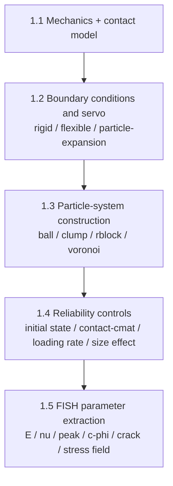

# Source Code: Meta Examples

This file carries non-solver source blocks `01` to `02`.

## Block 01 - Skill frontmatter template

```yaml
---
name: pfc-modeling-techniques
description: >
  Practical ITASCA PFC modeling techniques for geotechnical engineering:
  boundary servo (rigid / flexible / particle-expansion stress control),
  particle assembly construction (ball / clump / rblock / voronoi, zone-rblock
  conversion), four guarantees of reliable results (consistent initial/packing
  state, contact vs cmat property assignment, loading-rate effects, size effect
  correction), and FISH recipes to extract macro parameters (E, nu, peak
  strength, c/phi, crack tracking, stress field) from stress-strain curves.
  Use when the user asks how to actually build/servo/assign/calibrate-state a
  PFC model or extract macro parameters via FISH.
version: 1.0.0
related_skills:
  - pfc-workflow
  - pfc-foundations
---

# When to use
- Build a reasonable particulate/discrete assembly with controlled porosity,
  coordination, and overlap state.
- Choose a boundary strategy: rigid servo, flexible servo, or particle-expansion
  stress control.
- Construct ball/clump/rblock/voronoi style particles or polycrystal-like
  structures.
- Keep calibration and engineering models consistent and avoid loading-rate or
  size-effect artifacts.
- Use FISH to extract E, nu, peak strength, c/phi, crack statistics, or stress
  fields from stress-strain curves.

# Operating rules
1. Any complex model should first be brought to a low unbalanced-force,
   well-equilibrated state before contact assignment or production loading.
2. Calibration and engineering models should share confining state and particle
   size scale; otherwise the calibration basis drifts.
3. `contact` edits current contacts, while `contact cmat` controls future
   contacts. New-contact logic usually needs a callback.
4. Ramp loading from zero to avoid the initial stress pulse; do not rely on
   loading rate alone to represent real strain-rate effects unless the model is
   explicitly rate-dependent.
```

## Block 02 - Method overview flowchart


